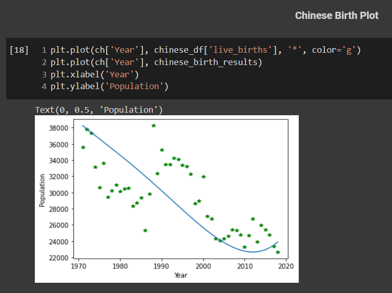
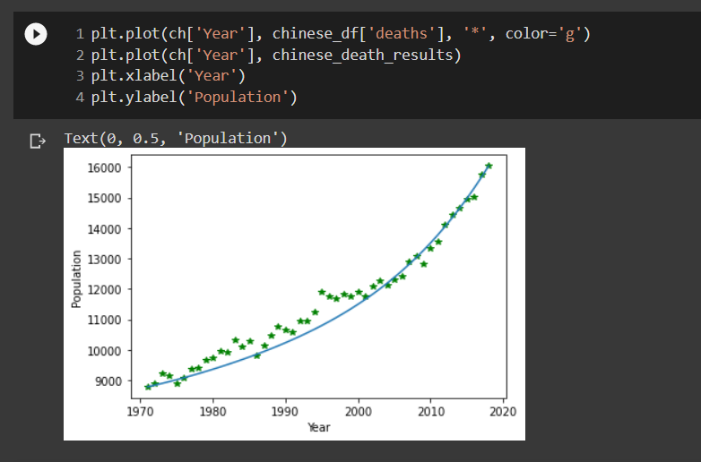
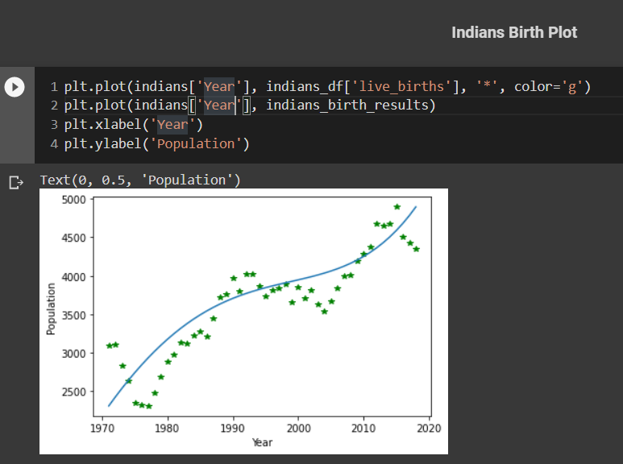
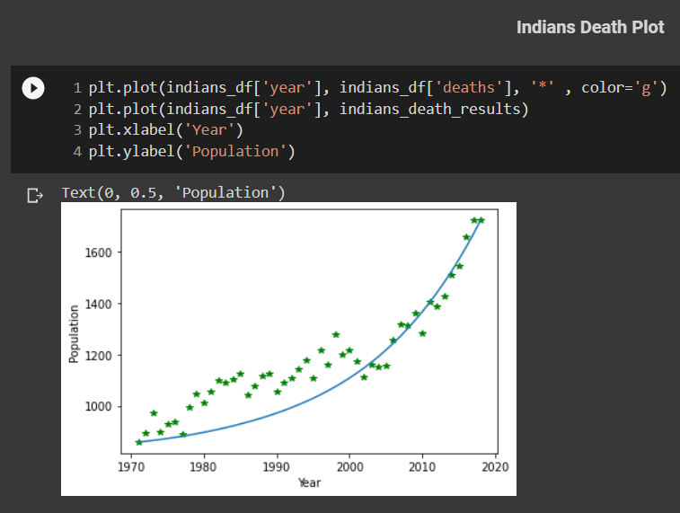
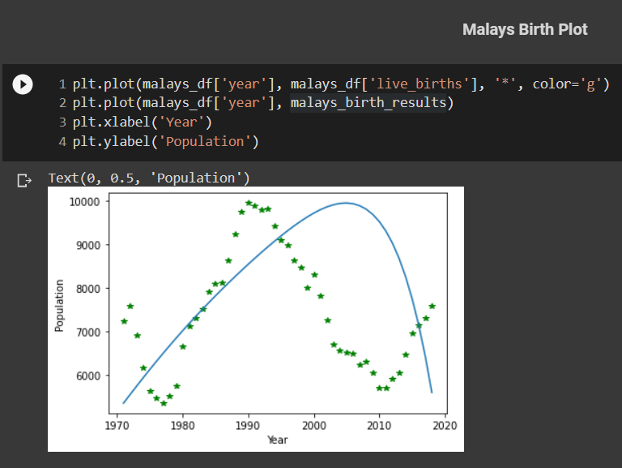
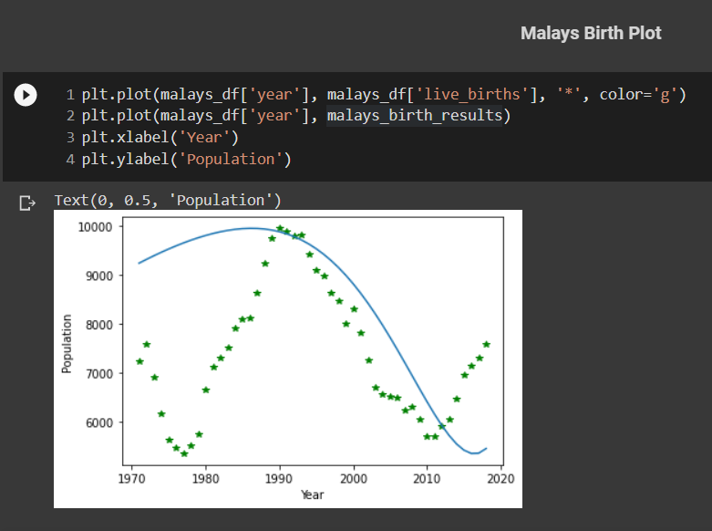
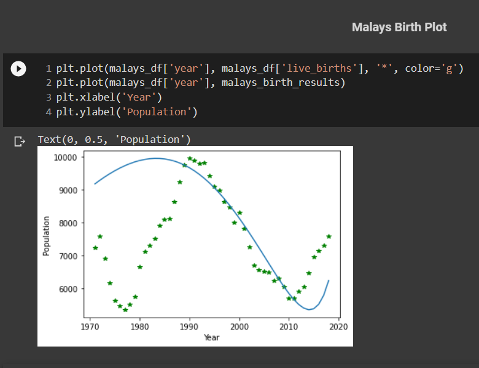
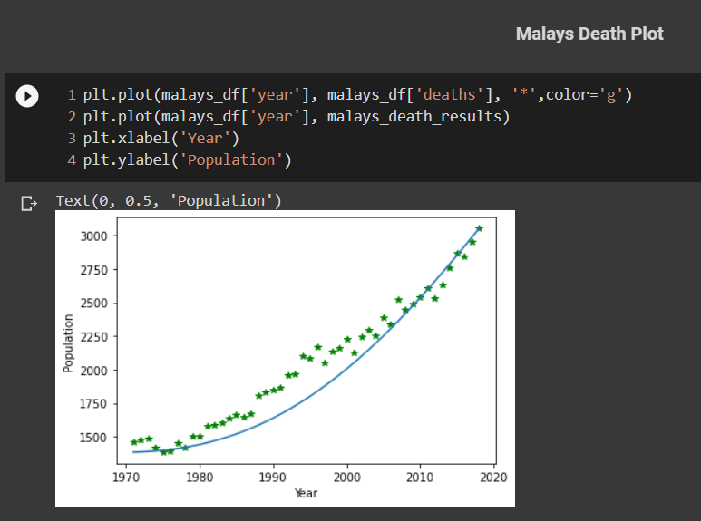

## Population Rate

In this problem, we have to predict a polynomial produced by genetic algorithm which predicts **Birth** and **Deaths** of **China**, **India** and **Malaysa**.

### Initial population
For this, there is a function named *initial_population()* in the code which has 2 arguments which are the **degree** of the polynomial and the number of **Coefficients**. It produces random coefficients between **0** and **1**.

### Crossover
For this part, Because the representation of the problem is **real-valued**, if we suppose that the chromosomes are **<x1, x2, ..., xn>**, it is divided into 2 parts. The first half is father and the other half of another chromosome is mother and by this, new child is generated.

### Mutation
I perform **mutation** on **20%** of the chromosomes and it is by adding or subtracting a random number between **0** and **1** to the genes of the selected chromosme.

### Fitness function
In order to work with small numbers instead of huge ones, I normalized all datas as in this problem the error values may be so large. The fitness function is the sum of all errors for one polynomial. For example, if we have **40** years, the error value for one polynomial is the sum of the errors of the specified polynomial exerted on each year. The error function is the absolute difference of the **real value** and the **computed value**.

### Survival Selection
For this part, I save each **polynomial** and its **error** in a list and sort it ascending, which means that by precding the list, the sutability decreases. So I remove the last **20%** of the elements and the others will go for the next crossover.

## Plots

### Chinese Birth
degree 4
</img>
degree 11
</img>

### Chinese Deaths
</img>

### Indians Birth
</img>

### Indians Death
</img>

### Malays Birth
degree 4
</img>
degree 7
</img>
degree 13
</img>

### Malays Death
</img>
