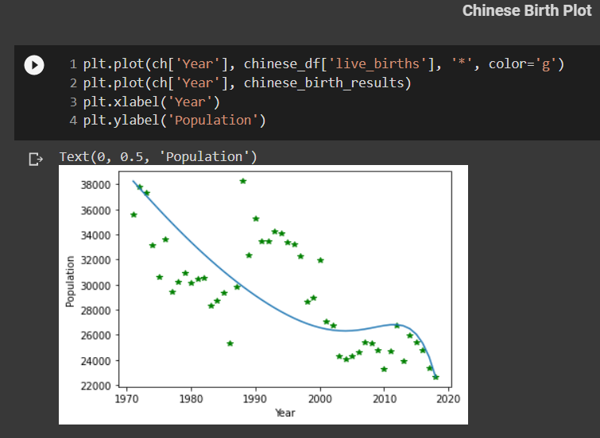
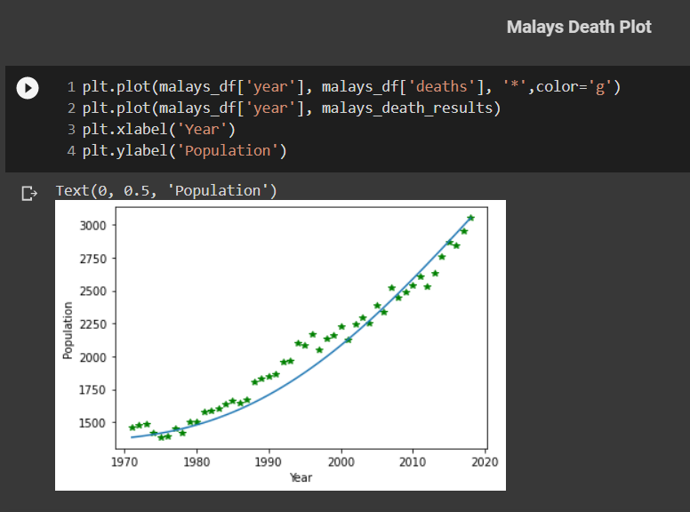

## Population Rate

In this problem, we have to predict a polynomial produced by genetic algorithm which predicts **Birth** and **Deaths** of **China**, **India** and **Malaysa**.

### Initial population
For this, there is a function named *initial_population()* in the code which has 2 arguments named **degree** and **coefficients**. Degree is our function degree and coeffiecinets is the number of coefficients generated. They are random values between 0 and 1.

### Crossover
For this part, Because the representation of the problem is **real-valued**, if we suppose that the chromosomes are **<x1, x2, ..., xn>**, it is divided into 2 parts. The first half of one chromosome is father and the other half of another random chromosome is mother and by this, new child is generated.

### Mutation
I perform **mutation** on **20%** of the chromosomes and it is by adding or subtracting a random number between **0** and **1** to the genes of the selected chromosme.
One important thing is to make sure that the result of the mutation should be the value between **-1** and **+1**.

### Fitness function
In order to work with small numbers instead of huge ones and as the error values may be so large, I normalized all datas. The fitness function is the sum of all errors for one polynomial. For example, if we have **40** years, the error value for one polynomial is the sum of the errors of the specified polynomial exerted on each year. The error function is the absolute difference of the **real value** and the **computed value**.

### Survival Selection
For this part, I save each **polynomial** and its **error** in a list and sort it in ascending order, which means the sutability decreases by precding the list. So I remove the last **20%** of the elements and the others will go for the next crossover.

## Plots

### Chinese Birth

</img>

degree 4

</img>

degree 11

### Chinese Deaths
</img>

### Indians Birth
</img>

### Indians Death
</img>

### Malays Birth
</img>

degree 4

</img>

degree 7

</img>

degree 13

### Malays Death
</img>

**Note**: By increasing the degree, the results are so better, but I didn't increase it that much.