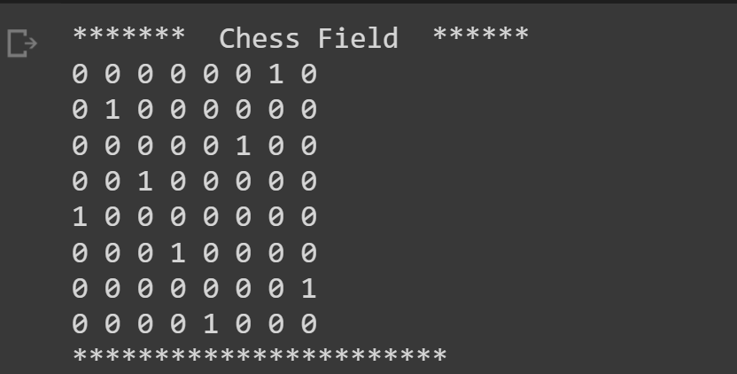

## N-Queen

### Initial Population
initial population function receives **2** arguments which are **n** and the number of the **initial answers**.

### Crossover
For crossover, The first half of the random chromosome is combined with the other half of another random chromosome.
In genetic algorithms, we can reach convergence by only mutation and crossover can be ignored in this problem, because it may produce bad offsprings(repeated positions) and so, in my idea, **mutation** is enough for this problem.

### Mutation
It is implemented on **20%** of the population and the position of two random elements are swapped.

### Fitness Function
The sum of the number of **threats** are the evaluation function. The smaller it is, the better answer we have.
The number of threats are the sum of **horizontal**, **vertical** and **diagonal** threats.

### Survivals
The last **20%** of the population are removed from the next generation.

### Finish time
when the number of threats are **0**, we have reached convergence. We can also reach the maximum number of iterations to finish the program. 

</img>

result for 10*10

### Source 
The source code is here in [colab](https://colab.research.google.com/drive/1W56FIfJeZliSm6a0HNqngSnf-t_1Yl0u?usp=sharing)